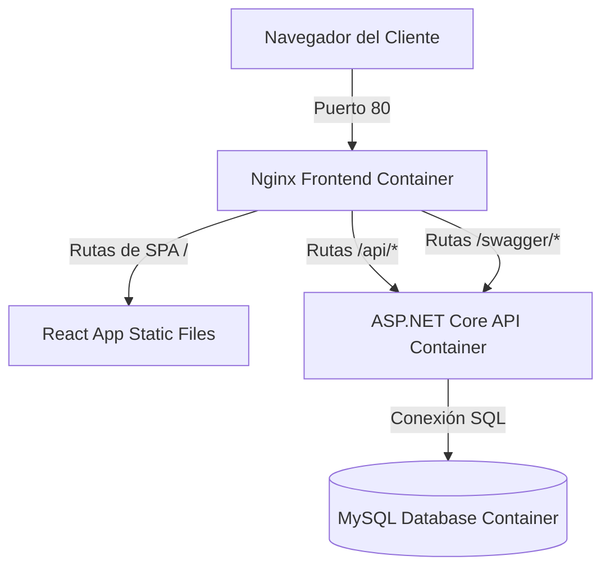

# 🏫 SmartSystema (Smart Campus Montessori)

[](https://dotnet.microsoft.com/)
[](https://react.dev/)
[](https://www.typescriptlang.org/)
[](https://www.docker.com/)
[](https://www.mysql.com/)
[](https://www.nginx.com/)

**SmartSystema** es una plataforma escolar integral diseñada específicamente para centros educativos bajo la metodología Montessori. Este repositorio unifica el backend en ASP.NET Core, la base de datos MySQL y la interfaz de usuario interactiva construida en React con TypeScript dentro de un entorno Dockerizado robusto y de dominio único.

---

## 🏗️ Arquitectura del Sistema

El proyecto está estructurado como una arquitectura unificada que utiliza el servidor web Nginx del frontend como puerta de enlace única (proxy inverso), eliminando los problemas de CORS y simplificando el despliegue bajo un único puerto/dominio.



---

## 📂 Estructura del Proyecto

*   **`Smart-Student-React/`**: Cliente Web interactivo SPA desarrollado en React + TypeScript + Vite.
*   **`MontessoriSystem/`**: API REST y Capa de Dominio / Persistencia en .NET 6.0.
*   **`docker-compose.yml`**: Archivo de orquestación raíz para levantar toda la infraestructura local con un solo comando.

---

## 🚀 Requisitos Previos

Antes de iniciar el proyecto, asegúrate de tener instalados:

*   [Docker Desktop](https://www.docker.com/products/docker-desktop/) (o Docker Engine con el plugin Compose).
*   [Git](https://git-scm.com/).

---

## 🛠️ Configuración e Instalación

### 1. Variables de Entorno (`.env`)

Crea un archivo llamado `.env` en la **raíz del proyecto** (al mismo nivel que `docker-compose.yml`) y define las variables de base de datos y cadenas de conexión del sistema. Puedes utilizar como base la siguiente plantilla:

```env
# Puerto en el que se expondrá la aplicación (Por defecto: 80)
FRONTEND_PORT=80

# Credenciales de la Base de Datos MySQL
MYSQL_ROOT_PASSWORD=TuPasswordSuperSegura
MYSQL_DATABASE=smartcampus_db
MYSQL_USER=smartcampus_user
MYSQL_PASSWORD=PasswordDelUsuario

# Cadenas de Conexión para el Backend (.NET)
# Nota: La dirección del servidor de base de datos es el nombre del servicio en docker-compose (smartcampus-mysql)
SECURITY_CONNECTION="Server=smartcampus-mysql;Database=smartcampus_db;Uid=smartcampus_user;Pwd=PasswordDelUsuario;Port=3306;CharSet=utf8mb4;"
IDENTITY_CONNECTION="Server=smartcampus-mysql;Database=smartcampus_db;Uid=smartcampus_user;Pwd=PasswordDelUsuario;Port=3306;CharSet=utf8mb4;"
DEFAULT_CONNECTION="Server=smartcampus-mysql;Database=smartcampus_db;Uid=smartcampus_user;Pwd=PasswordDelUsuario;Port=3306;CharSet=utf8mb4;"

# Configuración Adicional
URL_SEND_FORGOT_PASSWORD="http://localhost/auth/recovery-password"
```

### 2. Levantar la Aplicación con Docker

Una vez que tengas configuradas las variables de entorno, ejecuta el siguiente comando en la raíz del proyecto para construir las imágenes e iniciar los contenedores:

```bash
docker compose up --build -d
```

Este comando:
1.  Iniciará y configurará la base de datos MySQL con el healthcheck correspondiente.
2.  Compilará el backend en .NET 6 y correrá automáticamente las migraciones pendientes de Entity Framework.
3.  Compilará el frontend en React optimizado para producción, configurará Nginx como puerta de enlace, y expondrá la aplicación.

---

## 🔗 Endpoints Disponibles

| Servicio | URL | Descripción |
| :--- | :--- | :--- |
| **Frontend Web** | `http://localhost/` | Panel de Control, Estudiantes, Profesores e Institución. |
| **Documentación API** | `http://localhost/swagger` | Documentación Swagger interactiva de la API de backend. |
| **API Endpoints** | `http://localhost/api/v1/` | Puntos de enlace de la API (manejados internamente mediante proxy). |

---

## 🐳 Gestión de Contenedores

Comandos útiles para la administración diaria:

*   **Ver estados y logs de los contenedores:**
    ```bash
    docker compose logs -f
    ```
*   **Detener la ejecución sin borrar datos de volúmenes:**
    ```bash
    docker compose down
    ```
*   **Limpiar y reiniciar todo el ambiente:**
    ```bash
    docker compose down -v
    docker compose up --build -d
    ```
